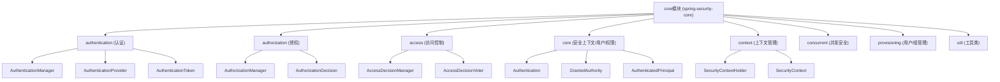

# Spring Security core模块架构与核心流程分析

---

## 一、整体架构

### 主要包结构与功能分层

- **authentication**：认证相关（如`AuthenticationManager`、`ProviderManager`、`AuthenticationProvider`、各种Token）
- **authorization**：授权相关（如`AuthorizationManager`、决策器等）
- **access**：访问控制（如`AccessDecisionManager`、`AccessDecisionVoter`、`ConfigAttribute`等）
- **core**：安全上下文、用户、权限等基础接口（如`Authentication`、`GrantedAuthority`、`SecurityContextHolder`等）
- **context**：安全上下文的存取与管理
- **provisioning**：用户/组管理
- **concurrent**：并发安全相关
- **util**：工具类

---

## 二、架构图



---

## 三、核心流程分析

### 1. 认证流程（Authentication）

- **入口接口**：`AuthenticationManager`（如`ProviderManager`实现）
- **流程主线**：
  1. 外部传入`Authentication`对象（如用户名密码Token）。
  2. `ProviderManager`遍历所有`AuthenticationProvider`，找到支持该类型的Provider并调用其`authenticate`方法。
  3. 认证成功后，返回一个已认证的`Authentication`对象（带有权限信息），并存入`SecurityContextHolder`。
  4. 认证失败则抛出异常。
- **关键类**：
  - `AuthenticationManager`：认证入口
  - `ProviderManager`：多Provider调度
  - `AuthenticationProvider`：具体认证实现
  - `Authentication`：认证对象（Token）
  - `SecurityContextHolder`：存储当前线程的认证信息

### 2. 授权流程（Authorization）

- **入口接口**：`AuthorizationManager`（新）、`AccessDecisionManager`（旧）
- **流程主线**：
  1. 认证通过后，授权管理器根据`Authentication`和目标资源的权限配置，判断是否有权访问。
  2. 授权失败抛出`AccessDeniedException`。
  3. 授权成功则继续执行后续业务逻辑。
- **关键类**：
  - `AuthorizationManager`：授权决策入口
  - `AccessDecisionManager`/`AccessDecisionVoter`：旧版决策机制
  - `ConfigAttribute`：权限配置
  - `SecurityContextHolder`：获取当前认证信息

### 3. 访问控制主线

- **调度核心**：`AbstractSecurityInterceptor`
  - 负责从`SecurityContextHolder`获取认证信息，调度认证与授权流程，最终决定是否放行请求。

---

## 四、主要入口文件

- **认证入口**：`AuthenticationManager`（接口），`ProviderManager`（实现）
- **授权入口**：`AuthorizationManager`（接口），`AccessDecisionManager`（旧接口）
- **安全上下文入口**：`SecurityContextHolder`
- **访问控制调度**：`AbstractSecurityInterceptor`（抽象类）

---

## 五、核心流程图（简化）

```mermaid
flowchart TD
    A[外部请求携带认证信息] --> B[AuthenticationManager.authenticate(Authentication)]
    B --> C{有支持的AuthenticationProvider?}
    C -- 否 --> D[抛出异常]
    C -- 是 --> E[Provider.authenticate(Authentication)]
    E --> F{认证成功?}
    F -- 否 --> D
    F -- 是 --> G[返回已认证Authentication]
    G --> H[SecurityContextHolder存储认证信息]
    H --> I[AuthorizationManager/AccessDecisionManager授权判断]
    I --> J{授权通过?}
    J -- 否 --> K[拒绝访问]
    J -- 是 --> L[放行到业务逻辑]
```

---

如需进一步分析某个子包/类，请补充说明！ 