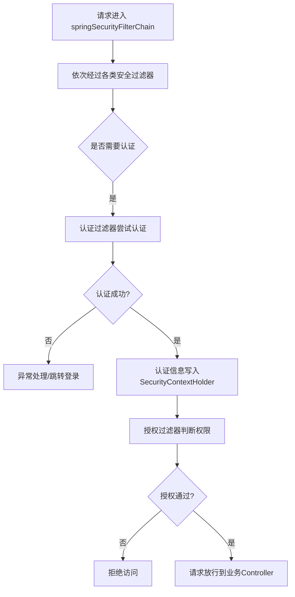

# Spring Security 项目架构与核心流程分析

---

## 一、整体架构

Spring Security 是 Spring 生态下的安全框架，提供了认证、授权、防护等安全服务，支持多种协议和集成方式。

### 主要模块划分

- **core**：安全核心功能（认证、授权、加密等），是其他模块的基础。
- **web**：基于 Servlet 的 Web 安全支持，提供过滤器链、会话管理、CSRF 等。
- **config**：自动化配置与 Java 配置支持，简化安全功能的集成。
- **oauth2**：OAuth2 相关实现，细分为 client、resource-server、jose、core 等子模块。
- **cas**：对 CAS（Central Authentication Service）的支持。
- **saml2**：SAML2 协议的服务提供者实现。
- **ldap**：LDAP 认证与集成支持。
- **messaging**：消息中间件（如 WebSocket、消息队列）安全支持。
- **data**：与 Spring Data 相关的安全扩展。
- **rsocket**：RSocket 协议的安全支持。
- **taglibs**：JSP 标签库，便于在视图层集成安全控制。
- **aspects**：AOP 切面相关的安全实现。
- **acl**：访问控制列表（ACL）相关实现。
- **test**：安全相关的测试工具和基类。
- **javascript**：前端安全相关的 JS 库和工具。

### 构建与依赖

- 使用 **Gradle** 作为构建工具，所有模块通过 `settings.gradle` 自动发现和配置。
- 每个模块有独立的 `*.gradle` 构建脚本，便于单独发布和测试。
- 支持将所有 jar 发布到本地 Maven 仓库，方便本地开发和调试。

---

## 二、核心流程与入口文件

### 1. 核心流程概述

Spring Security 的核心流程主要围绕**请求过滤链（Filter Chain）**展开，分为 Servlet（传统 Web 应用）和 WebFlux（响应式应用）两大主线。以 Servlet 为例，核心流程如下：

1. **入口 Filter**：所有请求首先进入 `springSecurityFilterChain`（类型为 `FilterChainProxy`），这是 Spring Security 的总入口。
2. **过滤器链**：`springSecurityFilterChain` 内部维护一组有序的安全过滤器（如 CSRF、认证、授权等）。
3. **认证流程**：
   - 典型的认证过滤器有 `UsernamePasswordAuthenticationFilter`（表单登录）、`BasicAuthenticationFilter`（HTTP Basic）等。
   - 这些过滤器会尝试从请求中提取认证信息，构造 `Authentication` 对象，交给 `AuthenticationManager` 进行认证。
   - 认证成功后，将认证信息存入 `SecurityContextHolder`，并可触发 RememberMe、Session 策略等。
4. **授权流程**：
   - 认证通过后，`AuthorizationFilter` 等过滤器会根据配置的访问策略判断当前用户是否有权访问资源。
   - 授权失败会抛出异常并由异常处理器（如 `AuthenticationEntryPoint`）处理。
5. **请求继续**：所有安全检查通过后，请求才会被放行到业务 Controller。

### 2. 主要入口文件

- **配置入口**：
  - `SecurityFilterChain` Bean（通常在配置类中定义）
  - `HttpSecurity` 用于配置过滤器链和安全策略
- **运行时入口**：
  - `springSecurityFilterChain`（`FilterChainProxy`）：所有请求的总入口 Filter
  - `UsernamePasswordAuthenticationFilter`、`BasicAuthenticationFilter`、`AuthorizationFilter` 等：核心安全过滤器，按顺序组成过滤链
- **认证与授权核心类**：
  - `AuthenticationManager`、`AuthenticationProvider`、`SecurityContextHolder`、`AuthorizationManager`

---

## 三、核心流程图（简化）

---

## 四、WebFlux 响应式安全

- 入口为 `WebFilterChainProxy`，配置方式类似，但用 `ServerHttpSecurity` 和 `WebFilter` 实现。

---

如需详细追踪某一具体流程（如表单登录、JWT、OAuth2等），可进一步指定分析方向。 