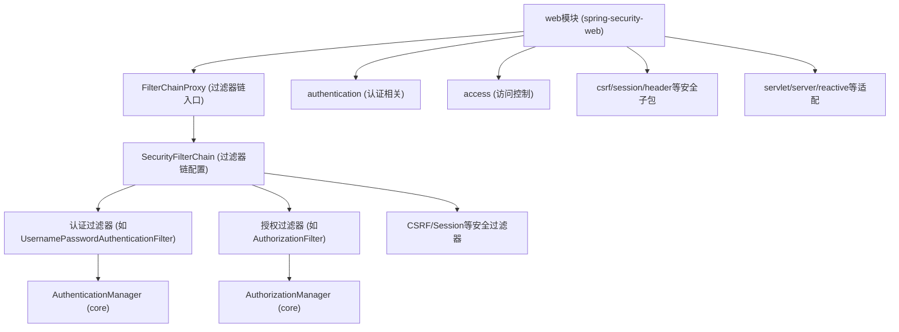
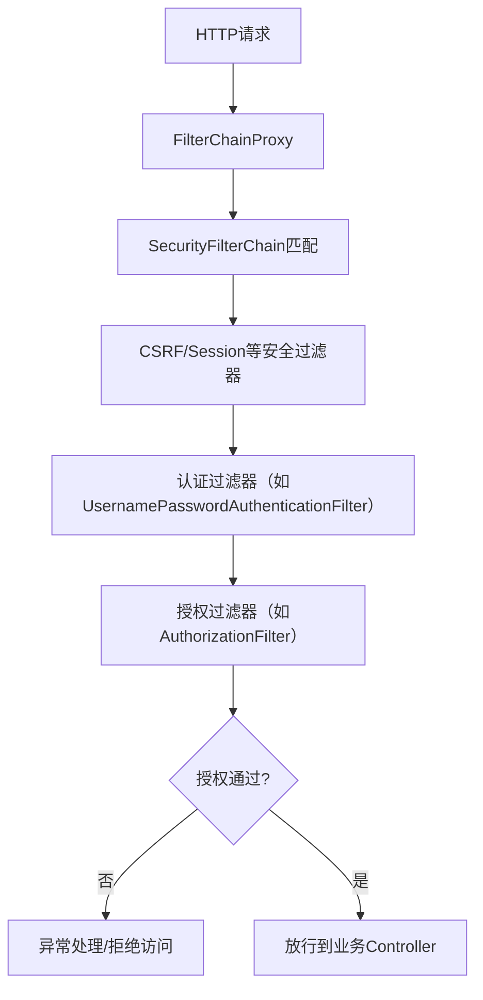

# Spring Security web模块架构与核心流程分析

---

## 一、整体架构

### 主要结构与分层

- **FilterChainProxy**：Web安全的总入口，负责调度所有安全过滤器。
- **SecurityFilterChain**：定义每个请求匹配的过滤器链（可有多条链，按URL等条件匹配）。
- **认证相关**（authentication）：如`UsernamePasswordAuthenticationFilter`，处理表单登录、Basic等认证方式。
- **授权相关**（access/intercept）：如`AuthorizationFilter`，基于`AuthorizationManager`进行访问控制。
- **其他安全过滤器**：如CSRF、Session、Header等。
- **适配层**：支持Servlet、Reactive(WebFlux)、Server等多种Web环境。
- **与core模块协作**：认证、授权的核心逻辑委托给core模块的`AuthenticationManager`、`AuthorizationManager`等。

---

## 二、架构图

---

## 三、核心流程分析

### 1. 过滤器链主线

- 所有HTTP请求首先进入`FilterChainProxy`。
- `FilterChainProxy`根据请求匹配到对应的`SecurityFilterChain`，并依次执行链上的各个安全过滤器。
- 典型过滤器顺序：CSRF → 认证 → 授权 → 其他安全处理。

### 2. 认证流程

- 以`UsernamePasswordAuthenticationFilter`为例：
  1. 拦截登录请求，提取用户名和密码，构造`UsernamePasswordAuthenticationToken`。
  2. 调用`AuthenticationManager`（core模块）进行认证。
  3. 认证成功后，将认证信息写入`SecurityContextHolder`，并跳转或返回成功响应。

### 3. 授权流程

- 以`AuthorizationFilter`为例：
  1. 从`SecurityContextHolder`获取当前认证信息。
  2. 调用`AuthorizationManager`（core模块）判断当前用户是否有权访问请求资源。
  3. 授权失败则抛出异常，授权成功则继续后续处理。

### 4. 其他安全处理

- 包括CSRF防护、Session管理、Header安全、异常处理等，均以过滤器形式插入到链中。

---

## 四、主要入口文件

- **FilterChainProxy**：web安全的总入口（Servlet Filter）。
- **SecurityFilterChain**：定义过滤器链的配置接口。
- **UsernamePasswordAuthenticationFilter**：表单登录认证的典型入口。
- **AuthorizationFilter**：基于AuthorizationManager的授权过滤器。
- **ExceptionTranslationFilter**：异常处理与跳转。
- **与core模块的接口**：`AuthenticationManager`、`AuthorizationManager`。

---

## 五、核心流程图（简化）

---

如需进一步分析某个子包/类，请补充说明！ 